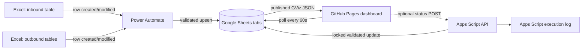

# StyleKorean logistics dashboard — system design and operations

## 1. Recommended architecture

The current deployment target is GitHub Pages, so the browser cannot watch a local `.xlsx` file, keep credentials secret, or run a database. The smallest production-ready design is:

1. **Excel remains an operator input** in OneDrive/SharePoint (or is imported into Google Drive).
2. **Power Automate** detects changed Excel table rows and upserts them into the corresponding Google Sheets tabs. If operators can use Google Sheets directly, omit this hop.
3. **Google Sheets is the operational read model.** Every source has a stable sheet name and headers.
4. **GitHub Pages serves this dashboard.** It polls the published Sheets Visualization API every 60 seconds, refreshes when a stale browser tab becomes visible, and keeps already-rendered data visible if a refresh fails.
5. **Google Apps Script is the optional write API.** It validates status values, locks concurrent writes, resolves the source row, and rejects stale updates.

This preserves the existing dependency-free site and avoids running an otherwise unnecessary server.



### Why this approach

- GitHub Pages stays cheap, fast, and simple.
- Power Automate is the appropriate watcher for cloud-hosted Excel. A browser-based file picker cannot monitor a closed local file.
- Google Sheets already backs the application and its published GViz endpoint works without adding a client dependency.
- Apps Script keeps write credentials out of the public repository. Do **not** put Microsoft Graph, Google service-account, or workbook credentials in browser JavaScript.

An always-on Node/Express service with `chokidar`, `xlsx`, WebSockets, PostgreSQL, and RBAC is appropriate only when Excel files live on a server filesystem or true sub-second updates and authenticated editing are mandatory. It is unnecessary for the present 60-second operational SLA.

## 2. Data flow and change detection

```text
Excel table row change
  -> automation validates required fields and creates a stable external_id
  -> upsert into the mapped Google Sheet tab
  -> published worksheet data changes
  -> dashboard poll fetches every configured tab with cache: no-store
  -> rows normalize into inbound/outbound records
  -> current stable keys are compared with the previous successful load
  -> schedules, KPIs, filters, and 14-day boards rerender
  -> operator sees a “new schedule entries detected” notification
```

The dashboard requests open-ended column ranges (for example, `A:AD`) rather than fixed row limits. Appending row 341 or row 2,504 therefore requires no code change. Requests use `Promise.allSettled`: one unavailable tab produces a partial-data warning while healthy tabs still render.

### Canonical fields

| Type | Required identity | Operational fields |
| --- | --- | --- |
| Inbound | shipment/invoice plus container, MBL, or AWB | ETA, mode, carrier, origin, destination, status |
| Outbound | source plus invoice/PO, PRO/BOL, or customer + ship date | carrier, quantity/dimensions, destination, rate, status |

Upstream Excel tables should include an immutable `external_id` UUID. Until it exists, the dashboard uses the composite identities above. Automation must normalize dates to ISO `YYYY-MM-DD`, trim identifiers, preserve leading zeroes as text, and reject rows without an identity.

## 3. Multiple workbook/sheet configuration

Source worksheets are defined in the `sources` array inside `load()` in `app.js`. Each entry is `[sheet name, open-ended range]`. To add a source:

1. Add or publish the tab in the master Google workbook.
2. Add its name/range to the array.
3. Add a mapper beside the existing inbound/outbound mappings.
4. Add the tab to `ALLOWED_SHEETS` in `google-apps-script/Code.gs` only if write-back is required.
5. Test missing columns, an empty tab, a duplicate identity, and a newly appended row.

For a second Google workbook, pass its spreadsheet ID as the third argument to `sheet(name, range, spreadsheetId)`. Keep public workbooks free of sensitive personal or commercial data: anything read anonymously by GitHub Pages is publicly retrievable.

## 4. UI layout

```text
┌──────────────────────────────────────────────────────────────────────┐
│ SK Logistics       Live Shipping Dashboard   [Refresh] [Open Sheet] │
├──────────────────────────────────────────────────────────────────────┤
│ ● sync status · partial/error detail   Auto-refresh 60s · timestamp │
│ [new rows / offline / retry notification]                            │
├────────┬────────┬────────┬────────┬────────┬────────┬────────┬────────┤
│ KPIs: active inbound/outbound, transit, due soon, costs, completed   │
├──────────────────────────────────────────────────────────────────────┤
│ Inbound — rolling 14-day schedule                                    │
├──────────────────────────────────────────────────────────────────────┤
│ Outbound — rolling 14-day schedule                                   │
├──────────────────────────────────────────────────────────────────────┤
│ Outbound filters              │ searchable operational table         │
├──────────────────────────────────────────────────────────────────────┤
│ Inbound filters               │ searchable table + tracking links    │
└──────────────────────────────────────────────────────────────────────┘
```

Tables intentionally remain horizontally scrollable on small screens because hiding logistics fields would be operationally unsafe. Status and sync messages use live regions for assistive technology.

## 5. Write-back API and editing

`google-apps-script/Code.gs` is the write endpoint. It accepts a narrow JSON request, permits only configured sheets/statuses, uses a script lock, verifies the status has not changed since it was read, and updates one uniquely resolved cell.

```js
await fetch(APPS_SCRIPT_URL, {
  method: "POST",
  headers: { "Content-Type": "text/plain;charset=utf-8" },
  body: JSON.stringify({
    kind: "outbound",
    sourceSheet: "WH Trucking Request",
    invoice: "IN12345",
    pro: "123456789",
    customer: "Customer name",
    shipDate: "2026-07-19",
    currentStatus: "SHIPPING",
    status: "DELIVERED"
  })
});
```

The public site currently treats the source workbook as the editor and the dashboard as the operational view. Do not enable anonymous status editing on a public Pages deployment. Follow `GOOGLE_SHEETS_SYNC.md` for internal write-back deployment.

### Authentication and roles

GitHub Pages cannot securely enforce roles. If browser editing becomes required, put the write API behind Cloud Run/Azure Functions with an identity-aware proxy:

| Role | View | Change status | Edit schedule/source config |
| --- | --- | --- | --- |
| Viewer | yes | no | no |
| Dispatcher | yes | yes | no |
| Admin | yes | yes | yes |

The API, not the UI, must enforce roles and maintain an audit record containing actor, timestamp, record ID, old value, and new value.

## 6. Error handling and notifications

| Condition | Current behavior | Operator action |
| --- | --- | --- |
| One sheet fails | Healthy sheets render; failed tab is named in sync bar | Check sharing/tab name, then refresh |
| Entire refresh fails | Existing rows remain visible; error notification appears; retry in 60s | Check network and workbook publication |
| Browser offline | Existing rows remain; offline notification; immediate refresh on reconnect | No action unless prolonged |
| Duplicate/ambiguous write | API rejects update | Refresh and correct duplicate identifiers |
| Stale write | API rejects changed current status | Refresh before retrying |
| Invalid row | Upstream automation should quarantine it | Correct required identity/date fields |

For production monitoring, configure Apps Script failure notifications and a Power Automate failure branch that posts to the logistics operations channel with workbook, table, row ID, and error—never the entire sensitive row.

## 7. Excel automation pseudocode

```text
trigger: When an Excel table row is added or modified
row = normalize(trigger.row)
assert row.external_id or canonical composite identity
assert parseable row.schedule_date
target = map workbook/table -> spreadsheet/tab

existing = GoogleSheet.find(target, external_id)
if existing:
    GoogleSheet.update(existing.row, row)
else:
    GoogleSheet.append(target, row)

on error:
    append sanitized failure to Sync_Errors
    notify operations with retry link
```

If Excel files are only on a Windows file share, use an on-premises data gateway plus Power Automate. File timestamps alone are insufficient; compare stable row IDs and content hashes so an in-place edit is detected without duplicating a schedule.

## 8. Publishing and acceptance checklist

1. In repository settings, configure Pages to deploy the current branch/root (or the repository’s established Pages workflow).
2. Confirm every source tab is published for read access and contains no data that must remain private.
3. Open `https://tokkiboi.github.io/stylekorean/` in a private browser session.
4. Append one test inbound row and one outbound row beyond each tab’s previous last row.
5. Within 60 seconds, verify the new-entry notification, KPI changes, schedule cards, filters, and tables.
6. Take one sheet temporarily offline and verify partial-data warning plus retained healthy data.
7. Restore connectivity and verify automatic recovery.
8. Test phone/tablet widths, keyboard-only navigation, and carrier links.
9. If write-back is deployed internally, test allowed, stale, invalid, ambiguous, and concurrent updates.

### Definition of done

- New and changed published rows appear within 60 seconds without a manual reload.
- A failed refresh never clears the last successfully rendered schedules.
- Partial-source failure is explicit and names affected tabs.
- No secrets exist in the repository or browser bundle.
- Editing is either performed in the source workbook or protected by server-enforced authentication and authorization.
